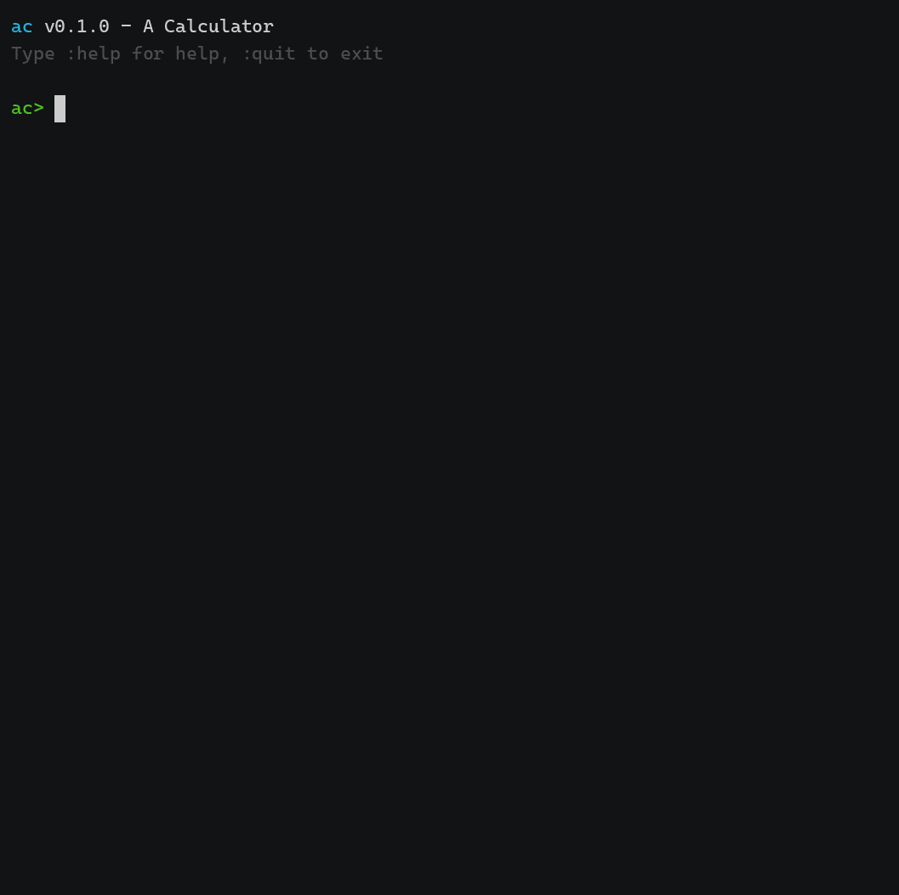

  

<h1 align="center">ac</h1>

A calculator for the terminal. A cousin of POSIX <code>bc</code> and <code>dc</code>. Written in Zig 0.16.0.

`ac` works with big decimal numbers of no fixed size. Addition, subtraction, and multiplication are exact. Division, remainder, square root, and power cut their results to `scale`.

## Modes

By default, `ac` reads infix, like `bc`:

    1 + 2 * 3

With `--rpn`, `ac` reads RPN, like `dc`:

    2 3 + p

## Build

You need Zig 0.16.0. Run:

    zig build

The binary is `zig-out/bin/ac`. On Windows, the name is `ac.exe`.

Run the test suite:

    zig build test

## Run

Give `ac` files, or one expression with `-e`:

    ac script.bc
    ac --rpn script.dc
    ac -e "1 + 2"
    ac --rpn -e "100 8 7 | p"

With no files and no `-e`, `ac` starts a REPL.

## Infix features

- Variables: `x = 3` (the assignment does not print), and the special variables `scale`, `ibase`, `obase`
- Bases 2 to 16 for `ibase` and `obase`
- `if`, `while`, `for`, and functions with `auto` locals and recursion
- Arrays: `a[0] = 3`. A bare name prints the array as `[3, 4]`.
- Builtins: `sqrt(x)`, `length(x)`, `scale(x)`, `read()`, `abs`, `ceil`/`ceil(x,p)`, `floor`, `round`/`r(x,p)`, `gcd`, `lcm`, `factorial`/`f`, `perm`, `comb`, `max`, `min`, `root`, `cbrt`, `modexp`, `band`/`bor`/`bxor`, `bnot8`/`bnot16`/`bnot32`/`bnot64`, `bshl`/`bshr`, `rand()`, `irand(n)`, `sci(x)`, `eng(x)`
- Math library with `-l`: `s`/`sin`, `c`/`cos`, `a`/`atan`, `t`/`tan`, `asin`, `acos`, `l`/`log`, `log2`/`l2`, `log10`/`l10`, `e`, `pi()`/`pi(s)`, `j(n, x)`. `-l` also sets `scale = 20`.
- REPL: Up/Down arrows recall previous lines. Tab completes names and `:commands`. History is `~/.ac_history`. The input line is colored. Nested continuation lines indent by brace depth, like the Python REPL.

Examples:

    $ ac -e "1 + 2"
    3
    $ ac -e "scale(0.25)"
    2
    $ ac -l -e "pi()"
    3.14159265358979323846
    $ ac -l -e "j(0, 1)"
    0.76519768655796655144
    $ ac -e "1.5e3"
    1500

## RPN features

- A stack, registers `s`/`l`, and hidden stacks `S`/`L`
- Macros: `x` and `?`
- Compare and run a register: `>r`, `<r`, `=r`, `!>`, `!<`, `!=`
- `Z` for the digit count, `X` for the scale, `|` for power with a modulus
- Array registers: `:r` to store, `;r` to load
- Strings in `[...]`
- `q` and `Q` to quit

Example:

    $ ac --rpn -e "[2 3 +] x p"
    5

## Options

| Option | What it does |
|---|---|
| `-e`, `--expression` | Run one expression |
| `--rpn` | Read RPN like `dc` |
| `--infix` | Read infix like `bc` |
| `-l`, `--mathlib` | Load the math library, and set `scale = 20` |
| `-q`, `--quiet` | Do not print the banner |
| `-s`, `--standard` | POSIX builtins only; hide extras |
| `-w`, `--warn` | Warn once on the first extra builtin |
| `--gnu` | Print the value of an assignment (GNU bc) |
| `--scale=N` | Set initial scale |
| `--ibase=N` | Set initial input base (2..16) |
| `--obase=N` | Set initial output base (2..16) |
| `--no-color` | Do not print colors |
| `-v` | Print the version |
| `-h` | Print help |

## Limits

`ac` runs the POSIX scripts that matter. It is not a GNU bc/dc clone.

- GNU-only commands do not exist here: `<<`, `>>`, `$`, `@`, `&&`, `||`
- `|` is a GNU extra, but `ac` has it
- `Z` and `X` count digits without trailing zeros: `0.0000` has `Z = 1`. GNU `dc` says `4`.

## License

MIT. See `LICENSE`.
